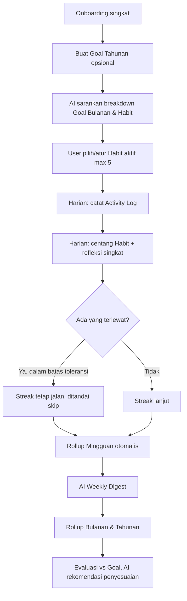
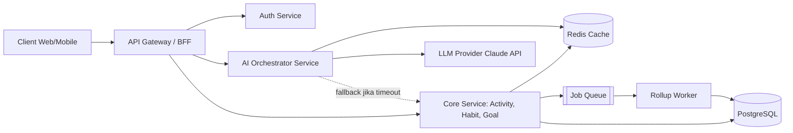
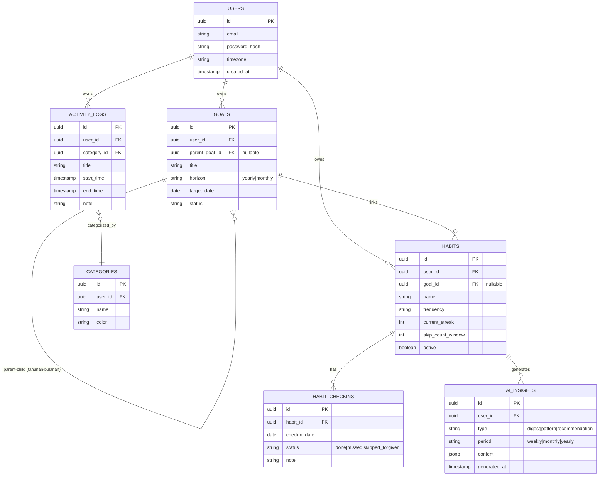
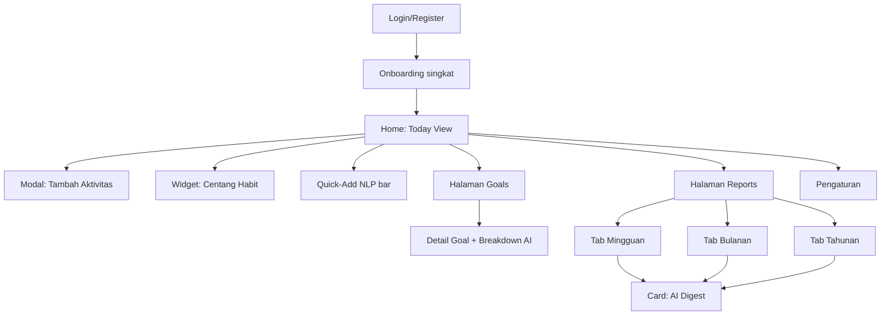

# Continuum — AI Productivity & Habit Tracking Platform

**Tagline:** Bangun kebiasaan produktif tanpa takut gagal — dari catatan harian sampai insight tahunan, ditenagai AI.

Continuum adalah platform tracking aktivitas dan habit yang menghubungkan setiap kebiasaan harian ke goal jangka panjang, dengan sistem anti-burnout (bukan streak kaku) dan rollup otomatis harian → mingguan → bulanan → tahunan. Fitur generatif AI menghasilkan ringkasan progres, deteksi pola, dan rekomendasi personal.

---

# 1. PRD — Product Requirements Document

## 1.1 Tujuan Produk

Continuum menyelesaikan masalah fragmentasi tracking produktivitas: orang memakai kombinasi to-do list, habit tracker, dan time tracker terpisah, sehingga data harian tidak pernah nyambung ke insight bulanan/tahunan, dan mayoritas habit tracker gagal karena desain streak yang kaku (all-or-nothing) membuat pengguna berhenti total setelah satu hari terlewat.

**Tujuan bisnis/proyek:**
- Membuat satu platform yang mencatat aktivitas harian, menautkannya ke habit, dan menautkan habit ke goal jangka panjang (tahunan).
- Desain anti-burnout: toleransi hari terlewat, batas jumlah habit aktif, refleksi singkat bukan interogasi panjang.
- Generatif AI sebagai lapisan insight: meringkas progres, mendeteksi pola, dan memberi rekomendasi personal — bukan sekadar dashboard angka.
- Sistem harus reliable dan responsif: setiap kegagalan (API AI down, race condition data, dsb.) punya fallback yang jelas dan dilaporkan, bukan diam-diam gagal.

**Metrik keberhasilan (Success Metrics):**

| Metrik | Target awal |
| --- | --- |
| Retensi 7 hari pengguna aktif | > 40% |
| Rata-rata habit aktif per user | 3–5 (sesuai riset anti-burnout) |
| Waktu untuk mencatat 1 aktivitas | < 10 detik |
| Uptime API inti (non-AI) | > 99% |
| Latensi rollup laporan bulanan | < 2 detik |

## 1.2 Target User

**Persona 1 — Mahasiswa/Fresh Graduate Multi-peran**
Kuliah + magang + organisasi + proyek pribadi berjalan bersamaan. Butuh satu tempat melihat "hari ini ngapain" dan "bulan ini progres ke mana" tanpa setup rumit.

**Persona 2 — Knowledge Worker/Freelancer**
Ingin tahu ke mana waktu kerja sebenarnya pergi; butuh laporan mingguan/bulanan untuk evaluasi diri.

**Persona 3 — Self-improvement Enthusiast**
Fokus membangun habit baik tapi sering gagal karena app lama terlalu ketat.

**Kebutuhan bersama:** cepat dicatat, tidak menghakimi saat gagal, dan memberi gambaran besar (bulanan/tahunan) dari data kecil harian.

## 1.3 Fitur

### Fitur Inti (Must Have)
1. **Activity Log** — catat aktivitas (judul, kategori, waktu mulai/selesai, keterangan, tag), manual atau quick-timer.
2. **Habit Tracker dengan Goal Context** — habit terhubung ke goal (mis. "Baca 20 menit/hari" → goal "Selesaikan 12 buku/tahun"); bukan checklist lepas.
3. **Goal Decomposition** — goal tahunan → bulanan → habit/task harian, dengan progres yang mengalir otomatis ke atas.
4. **Sistem Toleransi (Forgiveness)** — skip terbatas per periode tanpa reset streak ke nol; progres ditampilkan sebagai tren, bukan biner.
5. **Dashboard Rollup** — agregasi otomatis harian → mingguan → bulanan → tahunan (kategori tersibuk, tren konsistensi habit, target vs realisasi).
6. **Kategorisasi & Tag** fleksibel untuk aktivitas.
7. **Reminder kontekstual** — notifikasi berdasarkan pola waktu pengisian log pengguna, bukan jadwal generik.

### Fitur Generatif AI
8. **AI Weekly/Monthly Digest** — ringkasan naratif otomatis ("Minggu ini kamu paling produktif di kategori X; konsistensi habit Y turun 30%").
9. **AI Pattern Detection** — mendeteksi korelasi (mis. produktivitas turun di hari tertentu, habit sering bolong setelah aktivitas kerja lembur).
10. **AI Goal Recommendation** — saat user membuat goal tahunan, AI menyarankan pemecahan ke goal bulanan & habit harian yang realistis berdasarkan riwayat.
11. **AI Reflection Prompt** — pertanyaan refleksi harian yang di-generate kontekstual dari aktivitas hari itu (bukan template statis).
12. **Natural language quick-add** — user ketik "meeting sama dosen jam 2 siang 1 jam" → AI parsing jadi entry terstruktur otomatis.

### Fitur Should/Could Have (fase lanjut)
- Ekspor laporan (PDF/CSV).
- Integrasi kalender (Google Calendar) untuk auto-import aktivitas.
- Mode kolaborasi tim/goal bersama.
- Gamifikasi ringan (badge, bukan leaderboard kompetitif yang memicu burnout).

## 1.4 Flow Pengguna (High Level)



**Alur singkat:** Onboarding cepat (tanpa form panjang) → opsional set goal tahunan → AI bantu breakdown ke habit harian → siklus harian (catat + centang + refleksi 1 kalimat) → sistem toleran terhadap hari terlewat → data mengalir otomatis ke laporan mingguan/bulanan/tahunan dengan insight AI di setiap level.

---

# 2. SRS — Software Requirements Specification

## 2.1 Validasi Input

| Entitas | Field | Aturan Validasi |
| --- | --- | --- |
| Activity Log | title | wajib, 1–120 karakter |
| Activity Log | start_time / end_time | wajib, end_time > start_time, tidak boleh overlap dengan entry lain di kategori yang sama (warning, bukan block) |
| Activity Log | category | wajib pilih dari daftar kategori user (bisa custom, max 20 kategori aktif) |
| Habit | nama habit | wajib, 1–80 karakter |
| Habit | jumlah habit aktif | max 5 per user (soft-limit dengan konfirmasi bila user memaksa tambah) |
| Habit | frekuensi | wajib pilih: harian / hari tertentu / X kali per minggu |
| Goal | judul goal | wajib, 1–150 karakter |
| Goal | horizon | wajib pilih: tahunan / bulanan; goal bulanan wajib terhubung ke satu goal tahunan (nullable jika user pilih skip) |
| Refleksi harian | teks refleksi | opsional, max 500 karakter |
| Akun | email | wajib, format email valid, unik |
| Akun | password | min 8 karakter, kombinasi huruf+angka |

Semua validasi format dilakukan di frontend (instant feedback) DAN di backend (source of truth) — frontend tidak pernah dipercaya sebagai satu-satunya lapisan validasi.

## 2.2 System Behavior

**Habit & Streak Engine**
- Sistem menghitung streak berbasis rolling window, bukan biner reset-ke-nol: 1x skip dalam 7 hari terakhir tidak memutus streak ("forgiveness rule"); skip ke-2 dalam window yang sama baru menghentikan streak dan mencatatnya sebagai streak baru.
- Setiap habit yang tidak dicentang sampai jam 00:00 waktu lokal user otomatis berstatus "missed" dan masuk hitungan toleransi, bukan hilang diam-diam.

**Rollup Engine**
- Rollup harian → mingguan dijalankan sebagai scheduled job tiap hari jam 00:05 waktu lokal user (bukan real-time query berat), hasil di-cache.
- Rollup mingguan → bulanan → tahunan dijalankan sebagai job berkala + dapat di-trigger ulang manual oleh user ("refresh laporan").
- Jika job rollup gagal, sistem retry otomatis 3x dengan backoff, lalu jika tetap gagal, user diberi notifikasi eksplisit "laporan bulan ini belum terupdate, coba lagi" — TIDAK boleh menampilkan data basi tanpa keterangan.

**AI Generative Layer**
- Semua fitur AI (digest, pattern detection, rekomendasi goal, quick-add NLP) bersifat **best-effort dan non-blocking**: kegagalan/timeout layanan AI TIDAK BOLEH menghalangi fungsi inti.
- Setiap output AI diberi label jelas ("Dihasilkan AI") dan opsi "tidak akurat? koreksi".
- Quick-add NLP: jika AI gagal mem-parsing teks jadi entry terstruktur, sistem fallback ke form manual terisi sebagian.
- Rate limit pemanggilan AI per user (mis. max 50 request/hari).

**Notifikasi**
- Reminder dijadwalkan berdasarkan rata-rata jam pengisian log 14 hari terakhir user; default jam 20:00 waktu lokal jika data historis belum cukup.

## 2.3 Aturan Aplikasi/Bisnis

1. Satu goal tahunan dapat memiliki banyak goal bulanan; satu goal bulanan dapat menaungi banyak habit.
2. Menghapus goal tidak menghapus histori habit/activity log yang sudah tercatat — hanya memutus tautan (soft-unlink).
3. Data aktivitas & habit bersifat privat per user; tidak ada fitur publik/sharing di MVP.
4. Perubahan zona waktu perangkat memicu penyesuaian jadwal reminder & batas hari (00:00), dengan notifikasi ke user.
5. Retensi data: histori disimpan permanen selama akun aktif; akun yang dihapus, datanya dihapus penuh dalam 30 hari (soft delete lalu hard delete).

## 2.4 Non-Functional Requirements (Reliabilitas & Responsivitas)

| Kategori | Requirement |
| --- | --- |
| Performance | Waktu respons API CRUD inti (log, habit, goal) < 300ms p95 |
| Performance | Waktu render dashboard rollup < 2 detik untuk data 1 tahun |
| Availability | API inti (non-AI) target uptime 99% |
| Resiliency | Fitur AI degrade gracefully saat provider AI error/timeout |
| Observability | Setiap error backend tercatat dengan request-id; endpoint healthcheck tersedia |
| Error Reporting | Kegagalan job dikirim sebagai in-app notification + log ke sistem monitoring, bukan silent fail |
| Data Integrity | Semua write idempotent — retry client tidak menghasilkan duplikat |
| Security | Password di-hash (bcrypt/argon2); API pakai token auth (JWT) dengan expiry & refresh token |
| Scalability | Struktur database mendukung partisi per user_id |

**Kebijakan pelaporan masalah:** setiap kegagalan sistem (job gagal, AI timeout, validasi tembus) wajib menghasilkan log terstruktur (timestamp, user_id, jenis error, stack trace) sehingga bisa diaudit.

---

# 3. SDD — System Design Document

## 3.1 Arsitektur Sistem



**Pola arsitektur:** modular monolith di fase MVP, dipisah jadi service-layer yang jelas (Auth, Core, AI Orchestrator, Rollup Worker) supaya gampang dipecah ke microservices kalau scale-up.

**Kenapa AI Orchestrator terpisah dari Core:** supaya kegagalan/timeout AI tidak pernah memblokir request Core. AI Orchestrator punya circuit breaker: jika LLM provider gagal N kali berturut-turut, orchestrator otomatis "open circuit" sementara dan langsung fallback.

## 3.2 Struktur Backend (Layered)

```
src/
├── modules/
│   ├── auth/          # register, login, JWT, refresh token
│   ├── activity/       # CRUD activity log
│   ├── habit/          # CRUD habit, streak engine, forgiveness logic
│   ├── goal/           # CRUD goal tahunan/bulanan, decomposition
│   ├── rollup/         # scheduled job harian/mingguan/bulanan/tahunan
│   └── ai/             # orchestrator: digest, pattern detection, NLP quick-add
├── shared/
│   ├── middleware/     # auth guard, error handler, rate limiter
│   ├── validators/     # schema validation (mis. Zod/Joi)
│   └── utils/
├── infra/
│   ├── db/             # koneksi Postgres, migrations
│   ├── cache/          # koneksi Redis
│   └── queue/          # job queue (mis. BullMQ)
└── config/
```

Setiap module: `controller → service → repository`, supaya business logic terpisah dari akses data.

## 3.3 Skema Database (PostgreSQL)



**Catatan desain:** `AI_INSIGHTS.content` disimpan sebagai JSONB karena output generatif AI fleksibel; `HABIT_CHECKINS.status` punya nilai `skipped_forgiven` secara eksplisit supaya streak engine bisa membedakan "lupa" vs "ditoleransi" saat rollup.

## 3.4 Desain API (REST, endpoint utama)

| Method | Endpoint | Deskripsi |
| --- | --- | --- |
| POST | /api/auth/register | Registrasi user baru |
| POST | /api/auth/login | Login, return JWT + refresh token |
| POST | /api/activities | Buat activity log baru |
| GET | /api/activities?date=YYYY-MM-DD | List aktivitas per tanggal |
| POST | /api/habits | Buat habit baru (terhubung goal opsional) |
| POST | /api/habits/:id/checkin | Centang habit hari ini |
| GET | /api/goals/:id/breakdown | Lihat pemecahan goal tahunan → bulanan → habit |
| GET | /api/reports/monthly?month=YYYY-MM | Ambil rollup laporan bulanan (cached) |
| POST | /api/ai/quick-add | Kirim teks natural language, dapat entry terstruktur (draft) |
| GET | /api/ai/digest?period=weekly | Ambil ringkasan AI mingguan |
| POST | /api/ai/goal-suggestion | Minta AI sarankan breakdown goal |

Semua endpoint AI (`/api/ai/*`) punya timeout eksplisit (mis. 8 detik) dan response fallback terstruktur (`{"ai_available": false, "fallback": true}`) alih-alih hang atau 500 error mentah.

## 3.5 Tech Stack yang Disarankan

| Layer | Pilihan | Alasan |
| --- | --- | --- |
| Frontend | React/Next.js + Tailwind | Ekosistem luas, cocok untuk dashboard interaktif |
| Backend | Node.js (NestJS) atau Django | Struktur modular jelas |
| Database | PostgreSQL | Relasional kuat, dukung JSONB untuk AI insight |
| Cache | Redis | Cache rollup laporan agar dashboard cepat |
| Job Queue | BullMQ (Node) / Celery (Python) | Untuk scheduled rollup & retry AI job |
| AI Provider | Claude API (Anthropic) | Mendukung structured output (JSON) untuk parsing NLP |
| Hosting | Railway/Render (MVP) | Biaya rendah untuk tahap awal proyek mahasiswa |

---

# 4. UI/UX Flow

## 4.1 Peta Layar (Screen Map)



## 4.2 Alur Utama: Onboarding

1. **Login/Register** — form minimal (email, password). Tidak ada survei panjang.
2. **Onboarding (max 3 layar):** pilih goal tahunan (opsional) → AI tampilkan draft breakdown → pilih max 3–5 habit aktif.
3. Langsung diarahkan ke **Home: Today View**.

## 4.3 Alur Utama: Harian (Today View)

- **Quick-Add bar** di atas — user ketik bebas → AI parsing → preview entry terstruktur → user konfirmasi.
- **Daftar Activity Log hari ini** (kronologis) + tombol tambah manual.
- **Habit checklist** — max 5 kartu, tap untuk centang; hari terlewat dalam batas toleransi ditandai warna netral (bukan merah/silang tegas).
- **Prompt refleksi 1 kalimat** di akhir hari, pertanyaan digenerate AI dari konteks aktivitas hari itu.

## 4.4 Alur Utama: Goals

- List goal tahunan → **Goal Detail**: progress bar, daftar goal bulanan turunan, tombol "AI: sarankan penyesuaian".
- Goal bulanan baru dari dalam Goal Detail otomatis ter-link ke goal tahunan induknya.

## 4.5 Alur Utama: Reports

- Tab switcher: **Mingguan | Bulanan | Tahunan**.
- Setiap tab: grafik distribusi kategori waktu, tren streak habit, dan **card AI Digest** tampil duluan.
- AI gagal dimuat → card fallback "Ringkasan AI belum tersedia, coba muat ulang"; grafik & data mentah tetap tampil normal.

## 4.6 Prinsip UI/UX

1. **Non-punitive visual language** — tidak pakai merah tegas/silang besar untuk habit terlewat; abu-abu netral + teks kecil.
2. **AI selalu diberi label** — badge "✨ AI" + tombol koreksi.
3. **Zero empty state tanpa aksi** — setiap halaman kosong selalu punya CTA jelas.
4. **Loading vs error dibedakan tegas** — skeleton loading vs pesan error eksplisit + retry.
5. **Mobile-first** — Today View & Habit checklist optimal satu tangan.

---

# 5. Task Breakdown

## Tahap 1 — Riset & Definisi Masalah ✅ (sudah selesai)
- [x] Riset kompetitor & pain point pasar
- [x] Tentukan persona & use case utama
- [x] Tentukan diferensiasi (goal-linked habit + anti-burnout + AI)

## Tahap 2 — PRD, SRS, SDD, UI/UX Flow ✅ (sudah selesai)
- [x] PRD, SRS, SDD, UI/UX Flow (dokumen ini)

## Tahap 3 — Setup Proyek & Fondasi Teknis
- [ ] Inisialisasi repo (frontend + backend)
- [ ] Setup database PostgreSQL + migration skema
- [ ] Setup autentikasi (JWT + refresh token)
- [ ] Setup CI dasar (lint + test on push)
- [ ] Setup environment variable & secret management

## Tahap 4 — Implementasi Fitur Inti (Iteratif per Modul)
1. Activity Log (CRUD)
2. Categories & Tagging
3. Habit + Streak Engine + Forgiveness Rule
4. Goal + Goal Decomposition
5. Rollup Engine + caching
6. AI Orchestrator: Quick-Add NLP → AI Digest → Goal Recommendation

## Tahap 5 — Pengujian, Observability & Hardening
- [ ] Uji non-functional requirement (response time, fallback AI, idempotency)
- [ ] Setup logging terstruktur + healthcheck endpoint
- [ ] Uji edge case (timezone berubah, skip habit berkali-kali, goal dihapus)
- [ ] Review UI/UX terhadap prinsip non-punitive
- [ ] README + deploy

---

# 6. Prompt untuk Claude Code

Kirim satu per satu, jangan digabung — supaya scope tiap sesi tetap jelas dan hasilnya bisa direview bertahap.

## Prompt 1 — Setup Proyek & Fondasi (Tahap 3)

```
Saya sedang membangun "Continuum", platform tracking aktivitas dan habit dengan AI generatif. Tolong buatkan fondasi proyek berikut:

KONTEKS PROYEK:
- Arsitektur: modular monolith, layered (controller → service → repository)
- Modul: auth, activity, habit, goal, rollup, ai
- Stack: [ISI: mis. Node.js NestJS] untuk backend, [ISI: mis. Next.js + Tailwind] untuk frontend, PostgreSQL untuk database, Redis untuk cache, BullMQ/Celery untuk job queue
- AI Provider: Claude API (Anthropic)

TUGAS TAHAP INI:
1. Inisialisasi struktur repo sesuai layout berikut:
   src/modules/{auth,activity,habit,goal,rollup,ai}, src/shared/{middleware,validators,utils}, src/infra/{db,cache,queue}, src/config
2. Setup koneksi PostgreSQL + buat migration untuk skema: users, goals, habits, habit_checkins, activity_logs, categories, ai_insights (field lengkap ada di lampiran skema di bawah)
3. Implementasikan autentikasi: register, login, JWT access token + refresh token, password di-hash pakai bcrypt/argon2
4. Setup middleware: auth guard, global error handler (semua error terstruktur dengan request-id), rate limiter dasar
5. Setup environment variable untuk: DB connection string, Redis URL, Claude API key, JWT secret
6. Setup CI dasar: lint + run test on push (GitHub Actions)

SKEMA DATABASE (buat migration persis sesuai ini):
[TEMPEL skema ERD dari bagian 3.3 di atas]

OUTPUT YANG DIHARAPKAN:
- Proyek bisa dijalankan lokal (docker-compose untuk Postgres+Redis jika memungkinkan)
- Endpoint /api/auth/register dan /api/auth/login berfungsi dan bisa dites lewat curl/Postman
- Jelaskan di akhir: cara menjalankan proyek, dan bagian mana yang masih perlu saya isi manual (mis. API key)
```

## Prompt 2 — Modul Inti: Activity, Category, Habit, Goal (Tahap 4, bagian 1)

```
Lanjutkan proyek Continuum dari fondasi sebelumnya. Sekarang implementasikan modul inti berikut, urut sesuai dependency:

1. Modul Category: CRUD kategori aktivitas (max 20 kategori aktif per user)
2. Modul Activity Log: CRUD activity log dengan validasi:
   - title wajib 1-120 karakter
   - end_time harus > start_time
   - beri warning (bukan block) jika overlap waktu dengan entry lain di kategori sama
3. Modul Habit:
   - CRUD habit, max 5 habit aktif per user (soft-limit, minta konfirmasi jika user coba tambah lebih)
   - Endpoint checkin habit harian
   - STREAK ENGINE: implementasikan logic "forgiveness" — 1x skip dalam rolling 7 hari terakhir TIDAK memutus streak; skip ke-2 dalam window yang sama baru mereset streak. Field skip_count_window dan current_streak di tabel habits harus konsisten dengan ini.
   - Habit yang belum dicentang sampai jam 00:00 waktu lokal user otomatis berstatus 'missed'
4. Modul Goal:
   - CRUD goal dengan horizon 'yearly' atau 'monthly'
   - Goal bulanan wajib punya parent_goal_id ke goal tahunan (nullable jika user skip)
   - Endpoint GET /api/goals/:id/breakdown yang mengembalikan goal + semua goal bulanan turunannya + habit terkait
   - Menghapus goal TIDAK menghapus habit terkait, hanya soft-unlink (set goal_id jadi null di habit)

Setiap modul wajib punya unit test untuk business logic-nya (terutama streak engine dan validasi overlap).

OUTPUT: semua endpoint di atas berfungsi dan terdokumentasi singkat (daftar endpoint + contoh request/response).
```

## Prompt 3 — Rollup Engine (Tahap 4, bagian 2)

```
Lanjutkan proyek Continuum. Sekarang implementasikan Rollup Engine:

1. Scheduled job harian (jalan jam 00:05 waktu lokal tiap user) yang mengagregasi activity_logs dan habit_checkins hari sebelumnya menjadi ringkasan harian, disimpan/dicache di Redis
2. Job mingguan dan bulanan yang mengagregasi dari data harian: distribusi waktu per kategori, tren streak per habit, progress goal (checkin habit vs target)
3. Endpoint GET /api/reports/monthly?month=YYYY-MM yang mengambil hasil rollup dari cache (bukan hitung ulang tiap request)
4. RETRY LOGIC: jika job rollup gagal, retry otomatis 3x dengan exponential backoff. Jika tetap gagal setelah 3x, kirim notifikasi in-app ke user ('laporan belum terupdate, coba lagi') dan catat log error terstruktur (timestamp, user_id, jenis error, stack trace) — JANGAN biarkan silent fail atau menampilkan data basi tanpa keterangan.
5. Endpoint manual POST /api/reports/refresh untuk user memicu ulang rollup secara manual.

OUTPUT: job bisa diuji manual (trigger manual endpoint atau CLI command), dan tunjukkan log yang dihasilkan saat job sengaja dibuat gagal (untuk verifikasi retry+notifikasi bekerja).
```

## Prompt 4 — AI Orchestrator: Quick-Add, Digest, Rekomendasi (Tahap 4, bagian 3)

```
Lanjutkan proyek Continuum. Sekarang implementasikan modul AI Orchestrator yang terpisah dari Core Service (circuit breaker pattern), menggunakan Claude API:

1. POST /api/ai/quick-add: terima teks natural language (mis. 'olahraga 30 menit tadi pagi'), gunakan Claude API dengan structured output (JSON) untuk parsing jadi draft activity log {title, category_guess, start_time, end_time}. User masih harus konfirmasi sebelum tersimpan.
2. GET /api/ai/digest?period=weekly|monthly: generate ringkasan naratif dari data rollup periode tersebut (kategori tersibuk, tren habit, dsb.), simpan hasilnya ke tabel ai_insights (kolom content bertipe JSONB).
3. POST /api/ai/goal-suggestion: terima goal tahunan, minta Claude API sarankan breakdown ke goal bulanan + habit yang realistis berdasarkan riwayat aktivitas user (jika ada) atau template umum (jika user baru).

ATURAN WAJIB (non-negotiable):
- SEMUA endpoint AI di atas bersifat non-blocking: set timeout eksplisit 8 detik ke Claude API
- Jika Claude API timeout/error, kembalikan response terstruktur {ai_available: false, fallback: true} beserta fallback yang masuk akal
- Implementasikan circuit breaker sederhana: jika 5x panggilan berturut-turut gagal, orchestrator 'membuka circuit' selama 60 detik sebelum mencoba lagi
- Rate limit: max 50 request AI per user per hari, kembalikan error jelas jika terlampaui
- Setiap response yang mengandung hasil AI harus punya field is_ai_generated: true agar frontend bisa memberi label

OUTPUT: demo tiap endpoint dengan skenario normal DAN skenario Claude API disimulasikan gagal (mock/timeout), tunjukkan fallback bekerja.
```

## Prompt 5 — Testing, Observability & Hardening (Tahap 5)

```
Lanjutkan proyek Continuum, tahap terakhir sebelum dianggap siap dipakai:

1. Tambahkan endpoint /health yang mengecek koneksi DB, Redis, dan status circuit breaker AI
2. Pastikan semua write operation (checkin habit, buat activity log) bersifat idempotent — kirim request yang sama dua kali (mis. karena retry network) TIDAK boleh menghasilkan duplikat data
3. Uji dan tangani edge case berikut secara eksplisit:
   - User mengubah timezone perangkat: reminder & batas hari (00:00) harus menyesuaikan
   - Habit di-skip berkali-kali melebihi batas toleransi: streak harus reset dengan benar
   - Goal dihapus padahal masih ada habit terkait: habit tidak boleh error, goal_id jadi null
4. Setup logging terstruktur (JSON log) untuk semua error dengan field: timestamp, user_id, endpoint, error_type, stack_trace
5. Tulis README.md: cara install, environment variable yang dibutuhkan, cara menjalankan test, cara deploy

OUTPUT: laporan singkat hasil pengujian tiap edge case di atas (lolos/gagal + penjelasan), dan README final.
```

> Tips: sebelum kirim Prompt 1, ganti bagian [ISI: ...] dengan stack final yang kamu pilih, dan tempel skema ERD lengkap dari bagian 3.3 supaya Claude Code tidak menebak nama kolom.
